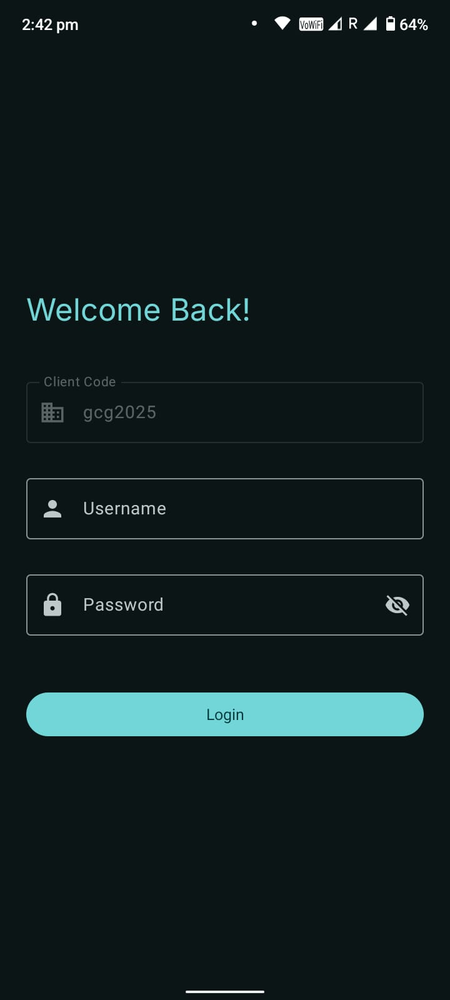
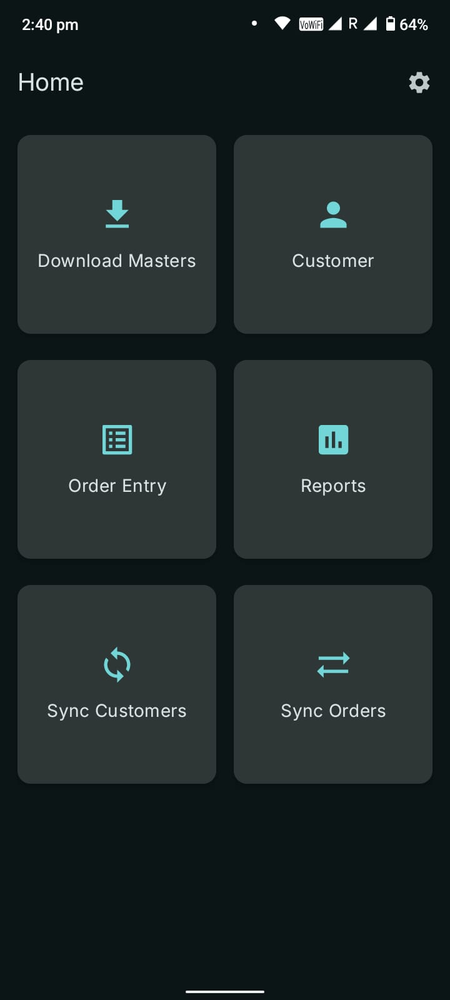
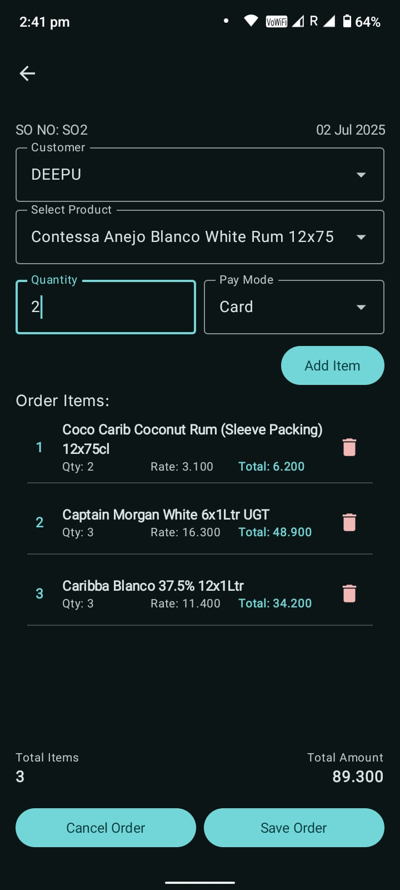
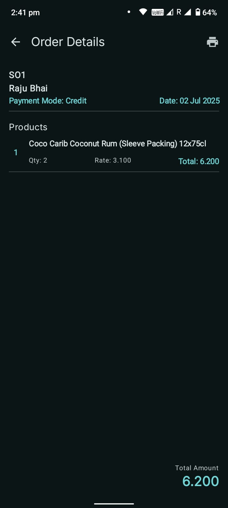
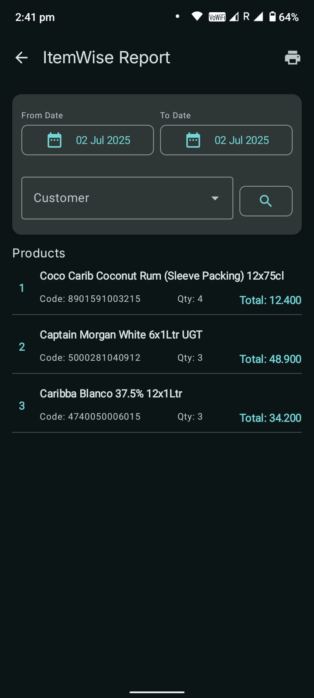

# 📦 Sales Order App (Jetpack Compose + Clean Architecture)

An offline-first sales order entry Android application built using modern Android development practices. This project is intended for learning and demonstrating clean architecture, Jetpack Compose, and data synchronization.

---

## 🚀 Features

- Offline-first architecture with Room local database
- Jetpack Compose UI with Scaffold, LazyColumn, Dialogs
- Navigation with arguments (Navigation Component)
- Data sync mechanism (Upload & Download)
- Hilt for dependency injection
- Retrofit for API communication
- StateFlow & ViewModel for reactive state management
- Master data download and local storage
- **Material You Light & Dark Theme Support**
- Clean and modular folder structure

---

## 🛠️ Tech Stack

- **Language:** Kotlin
- **UI:** Jetpack Compose
- **Architecture:** MVVM + Clean Architecture
- **State Management:** StateFlow, ViewModel
- **Dependency Injection:** Hilt
- **Networking:** Retrofit
- **Local Database:** Room
- **Navigation:** Jetpack Compose Navigation
- **Theming:** Material Design 3 with Light and Dark Mode

---

## 📁 Folder Structure

```bash
├── data/
│   ├── local/        # Room DB and DAO
│   ├── remote/       # Retrofit API service
│   ├── repository/   # Repository implementations
├── domain/
│   ├── model/        # Data models
│   ├── repository/   # Repository interfaces
│   └── usecase/      # Business logic
├── presentation/
│   ├── login/
│   ├── home/
│   ├── components/   # Reusable Compose UI
│   └── navigation/   # AppNavGraph
├── di/               # Hilt modules
├── theme/            # Material light & dark themes
├── utils/            # Network check, constants, etc.

```


## 📱 Screenshots

<table>
  <tr>
    <td align="center"><strong>🔐 Login</strong></td>
    <td align="center"><strong>🏠 Home</strong></td>
    <td align="center"><strong>🧾 Order Entry</strong></td>
  </tr>
  <tr>
    <td></td>
    <td></td>
    <td></td>
  </tr>
  <tr>
    <td align="center"><strong>📊 Report Summary</strong></td>
    <td align="center"><strong>📋 Itemwise Report</strong></td>
  </tr>
  <tr>
    <td></td>
    <td></td>
  </tr>
</table>


